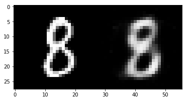
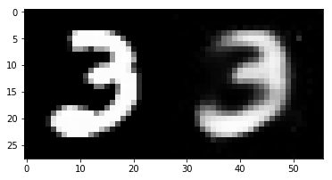
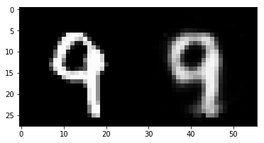

# fun-with-machine-learning

Classic machine learning algorithms implemented in python, just for fun)

# Autoencoder

Example of a autoencoder on MNIST dataset.
Original image on the left, predicted after autoencoder on the right.





## Pytorch

Compare performance Pytorch vs Numpy

## Neural Network

Neural Network ready to solve different problem.

### Solve XOR problem

```
cd neural_network
python xor_problem.py
```

### Solve a classic problem (MNIST dataset) using own Neural Network

### Load mnist dataset

```
cd neural_network
bash load_mnist.sh
```

### Run training network

```
cd neural_network
python mnist_problem.py
```
